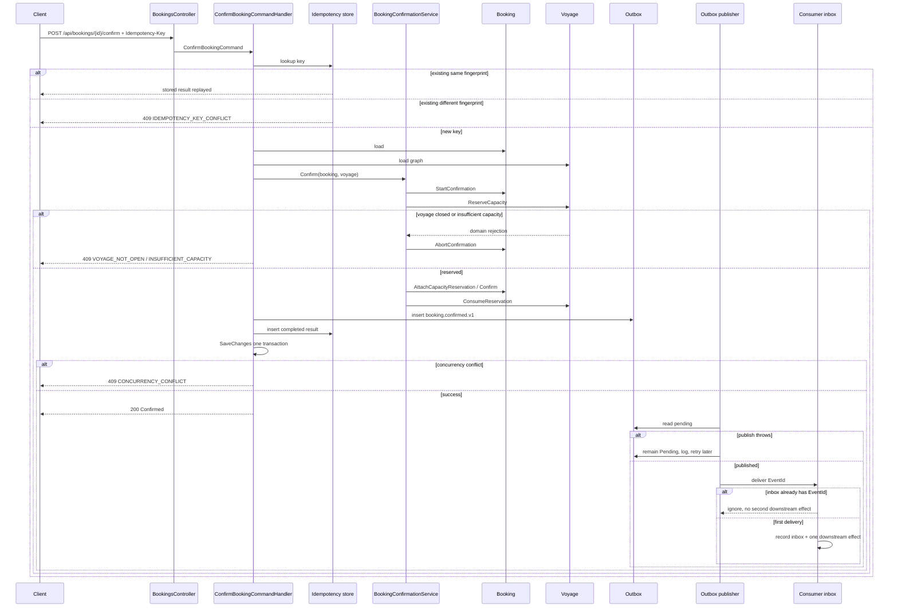

# Booking Confirmation sequence

```mermaid
sequenceDiagram
  participant C as Client
  participant API as BookingsController
  participant H as ConfirmBookingCommandHandler
  participant I as Idempotency store
  participant S as BookingConfirmationService
  participant B as Booking
  participant V as Voyage
  participant O as Outbox
  participant P as Outbox publisher
  participant D as Consumer inbox

  C->>API: POST /api/bookings/{id}/confirm + Idempotency-Key
  API->>H: ConfirmBookingCommand
  H->>I: lookup key
  alt existing same fingerprint
    I-->>C: stored result replayed
  else existing different fingerprint
    I-->>C: 409 IDEMPOTENCY_KEY_CONFLICT
  else new key
    H->>B: load
    H->>V: load graph
    H->>S: Confirm(booking, voyage)
    S->>B: StartConfirmation
    S->>V: ReserveCapacity
    alt voyage closed or insufficient capacity
      V-->>S: domain rejection
      S->>B: AbortConfirmation
      H-->>C: 409 VOYAGE_NOT_OPEN / INSUFFICIENT_CAPACITY
    else reserved
      S->>B: AttachCapacityReservation / Confirm
      S->>V: ConsumeReservation
      H->>O: insert booking.confirmed.v1
      H->>I: insert completed result
      H->>H: SaveChanges one transaction
      alt concurrency conflict
        H-->>C: 409 CONCURRENCY_CONFLICT
      else success
        H-->>C: 200 Confirmed
        P->>O: read pending
        alt publish throws
          P->>O: remain Pending, log, retry later
        else published
          P->>D: deliver EventId
          alt inbox already has EventId
            D-->>P: ignore, no second downstream effect
          else first delivery
            D->>D: record inbox + one downstream effect
          end
        end
      end
    end
  end
```

Domain events stay on the aggregates. Only `booking.confirmed.v1` is written to the outbox and delivered at-least-once.
