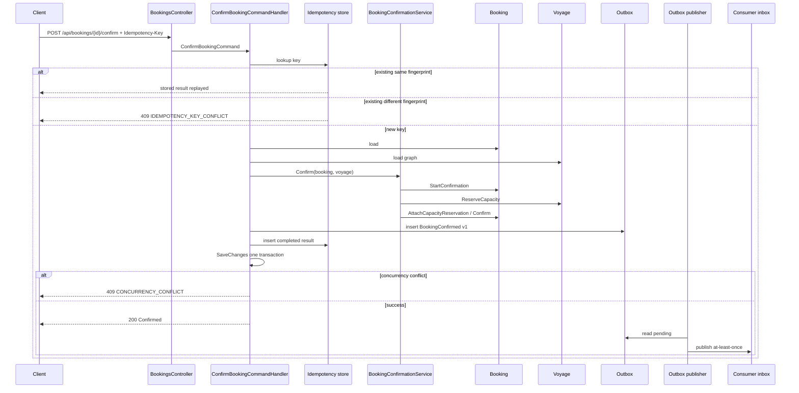

# Booking Confirmation sequence

```mermaid
sequenceDiagram
  participant C as Client
  participant API as BookingsController
  participant H as ConfirmBookingCommandHandler
  participant I as Idempotency store
  participant S as BookingConfirmationService
  participant B as Booking
  participant V as Voyage
  participant O as Outbox
  participant P as Outbox publisher
  participant D as Consumer inbox

  C->>API: POST /api/bookings/{id}/confirm + Idempotency-Key
  API->>H: ConfirmBookingCommand
  H->>I: lookup key
  alt existing same fingerprint
    I-->>C: stored result replayed
  else existing different fingerprint
    I-->>C: 409 IDEMPOTENCY_KEY_CONFLICT
  else new key
    H->>B: load
    H->>V: load graph
    H->>S: Confirm(booking, voyage)
    S->>B: StartConfirmation
    S->>V: ReserveCapacity
    S->>B: AttachCapacityReservation / Confirm
    H->>O: insert BookingConfirmed v1
    H->>I: insert completed result
    H->>H: SaveChanges one transaction
    alt concurrency conflict
      H-->>C: 409 CONCURRENCY_CONFLICT
    else success
      H-->>C: 200 Confirmed
      P->>O: read pending
      P->>D: publish at-least-once
    end
  end
```
